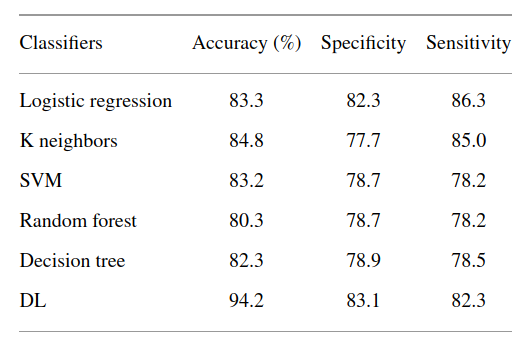

# Final Project Cabrera

Fecha de entrega 28 de noviembre de 2021

# Table of Contents
- [Final Project Cabrera](#final-project-cabrera)
- [Table of Contents](#table-of-contents)
- [Team Members](#team-members)
- [Project Description](#project-description)
- [Setup](#setup)
- [Link to the original paper from this Repo takes inspiration from](#link-to-the-original-paper-from-this-repo-takes-inspiration-from)
- [Link to the video presentation](#link-to-the-video-presentation)
- [DataSet download](#dataset-download)

# Team Members
 - Jesús Omar Cuenca Espino A01378844
 - Fernanda G. Bueso Medina A00822411
 - Gerardo A. Silva Razo A01136536
 - Alberto Dávila Almaguer A01196987
 - Jose Guillermo Cazares Rodriguez A01740254

# Project Description

For this project the objective was to recreate a research paper that we found online with relevance on Machine Learning focussed on some Health Topic. 

We decided to recreate [this paper](#link-to-the-original-paper-from-this-repo-takes-inspiration-from) that can be found online that uses a dataset on heart disease with some tabular features that can be used to implement 5 Machine Learning models and a Neural Network in order to predict if the person who that data is taken from will or will not present a heart disease in the future.

While the dataset that we used is not exactly the same, we used a similar dataset with similar features and recreated as accurately as possible the same methodology that the researchers of the paper used.

We didn't get exactly the same results as they did; seen in the figure below.

<p align="center">
    
</p>

However regardless of our different datasets we did get similar results in some cases, and better results in most cases for the machine learning models.

# Setup

We provided a **requirements.txt** file so that it is easy to install all the required packages needed to run our code.

We recommend using a **venv** Virtual environment.

```bash
    $ python3 -m venv env && source env/bin/activate
    $ pip install -r requirements.txt
```

To run the code then you need **Jupyter Notebook** either in Google Colab or locally.

```bash
    $ python3 -m notebook
```

You will also need to download the dataset that we used in order to run our code which can be found in the link in the corresponding section.

[Download the dataset](#dataset-download)

# Link to the original paper from this Repo takes inspiration from

[Link to the original paper](https://www.hindawi.com/journals/cin/2021/8387680/)

# Link to the video presentation

[Video on Youtube](https://youtu.be/OzU7iMoTakU)

# DataSet download

[Click Here](https://www.kaggle.com/pritsheta/heart-attack/code) to go to the Kaggle website where you can download the dataset.

Make sure to leave it in a directory named **data**.